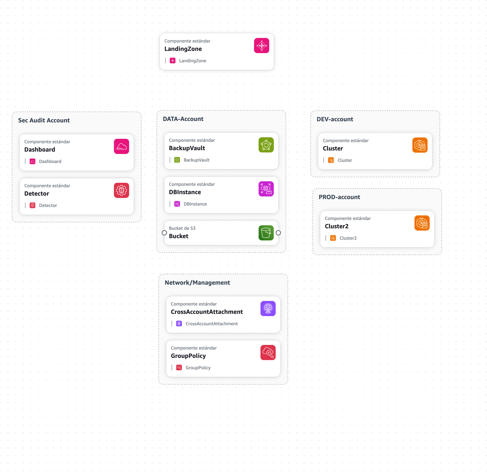

# Cloud-Architecture-Design
Create a comprehensive cloud architecture design document for Innovate Inc.'s web application deployment, focusing on AWS as the chosen cloud provider due to its mature managed Kubernetes offering (EKS) and extensive managed services ecosystem.
-----------
Description
One of our clients is a small startup called "Innovate Inc." They are developing a web application (details below) and are looking to deploy it on one of the two major cloud providers(AWS or GCP). 

They have limited experience with cloud infrastructure and are seeking your expertise to design a robust, scalable, secure, and cost-effective solution. 

They are particularly interested in leveraging managed Kubernetes and following best practices.Application Details:
•Type: Web application with a REST API backend and a single-page application (SPA) frontend.•Technology Stack: Backend: Python/Flask, Frontend: React, Database: PostgreSQL.
•Traffic: The expected initial load is low (a few hundred users per day), but they anticipate rapid growth to potentially millions of users.
•Data: Sensitive user data is handled, requiring strong security measures.
•Deployment Frequency: Aiming for continuous integration and continuous delivery (CI/CD).

Assignment:
Create an architectural design document for Innovate Inc.'s Cloud infrastructure. 
The document should address the following key areas:
1.Cloud Environment 
Structure:1.Recommend the optimal number and purpose of AWS accounts/GCP  Projects for Innovate Inc. and justify your choice. Consider best practices for isolation, billing, and management.
2.Network Design:
1.Design the Virtual Private Cloud (VPC) architecture.2.Describe how you will secure the network.
3.Compute Platform:
1.Detail how you will leverage Kubernetes Service to deploy and manage the application.
2.Describe your approach to node groups, scaling, and resource allocation within the cluster.
3.Explain your strategy for containerization, including image building, registry, and deployment processes.
4.Database:1.Recommend the appropriate service for the PostgreSQL database and justify your choice.
2.Outline your approach to database backups, high availability, and disaster recovery.

Deliverables: A git repository (you may include this in the git repository from the other task) containing a README architecture document with at least one HDL (High-Level Diagram) to illustrate the architecture.

## Suggested Accounts
```
AWS Organizations (root org)
│
├── Management account       ← Access control (IAM), billing, config
├── Network account          ← VPC central, TGW, Direct Connect, endpoints
├── Security/Audit account   ← CloudTrail, Config, GuardDuty, etc.
├── Shared services          ← CI/CD, DNS, logs, ECR, etc.
├── Workload accounts:
│    ├── Dev
│    ├── Test(optional)
│    ├── Prod
│    └── Data
```
