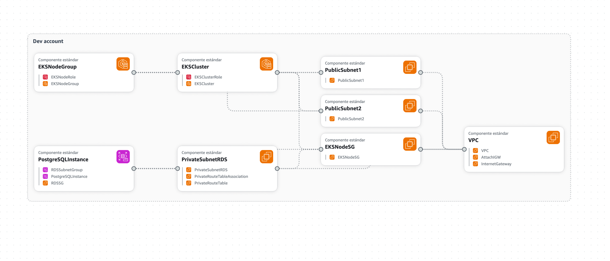

# PostgreSQL Architecture Plan for AWS Deployment

## 📌 Objective

Design a scalable, secure and production-grade PostgreSQL deployment for the Innovate Inc. web application, considering development and production lifecycle needs.

---

## 🔧 Database Deployment Options

### 1. ✅ **Amazon RDS for PostgreSQL**
- Fully managed PostgreSQL engine
- Automated backups, patching, Multi-AZ support
- Best choice for standard workloads requiring compatibility and simplicity

### 2. 🚀 **Amazon Aurora PostgreSQL-Compatible**
- High-performance managed engine
- Up to 5× read scalability with Aurora Replicas
- Storage autoscaling up to 128 TB
- Instant failover and higher resilience

> 🧠 Aurora is preferred for production workloads expected to scale in user base, read demand, or require high availability and performance.

---

## 🧱 Deployment Strategy

### 🔐 **Production Environment**
- The production PostgreSQL instance will be deployed **in a dedicated AWS account ("Data Account")**.
- It will reside in **private subnets**, inaccessible from the internet.
- Access is allowed **only via VPC peering or Transit Gateway** from the EKS workloads running in the "App Account".
- Database authentication will use **IAM database authentication or Secrets Manager**.
- Security Groups and IAM roles will restrict access to trusted workloads only.
- Backups, monitoring, and encryption will be enabled.

### 🧪 **Development Environment**
- Developers are allowed to:
  - Use a **local PostgreSQL instance** via Docker or directly on local machines.
  - Or optionally, a lightweight **RDS instance in a non-production AWS environment** (cost-optimized).
- **Development environments must not have access to production data**.
- Local database configs will be injected via `.env` files or ConfigMaps in Kubernetes.

---

## 🔄 Cross-Account Access

EKS workloads running in the **Application Account** will access the database in the **Data Account** via:

1. **VPC Peering** or **AWS Transit Gateway**
2. IAM **cross-account roles** for least-privilege access
3. Network and security policies (SGs + NACLs)

> This ensures network-level isolation, traceability, and security compliance.

---

## 🧰 Configuration Summary

| Component              | Value / Setup                                             |
|------------------------|-----------------------------------------------------------|
| Engine                 | PostgreSQL 14.x                                           |
| Production Host        | RDS or Aurora in `data` account (private subnet)          |
| Development Host       | Local for eks or dev RDS                                  |
| Authentication         | IAM        Secrets Manager                                |
| Access method          | Transit Gateway + IAM AssumeRole + SG Rules               |
| Encryption             | KMS enabled                                               |
| Backups                | Daily automated backups + retention policy                |
| Monitoring             | CloudWatch Metrics + Enhanced Monitoring + Alarms         |
| Maintenance Window     | Weekly, outside business hours                            |

---

## ✅ Best Practices

- Use **Aurora** if:
  - You expect high read traffic, auto-scaling needs, or require fast failover.
- Use **standard RDS** if:
  - Your workload is light/medium and you prioritize cost and simplicity.
- Always enforce **network isolation**, **IAM-based access**, and **separate environments**.
- Regularly test **backups and restore procedures**.

---
